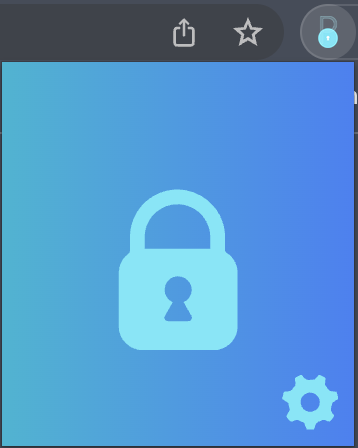

<h1 style="color: rgb(77, 159, 235)">BullyProof</h1>

A chrome extension social media filtering tool to protect vulnerable or at-risk individuals from bullying based on semantic models, search bots, natural language processing, and an interface that allows users to easily apply the tool to their social media feeds.

</img>

